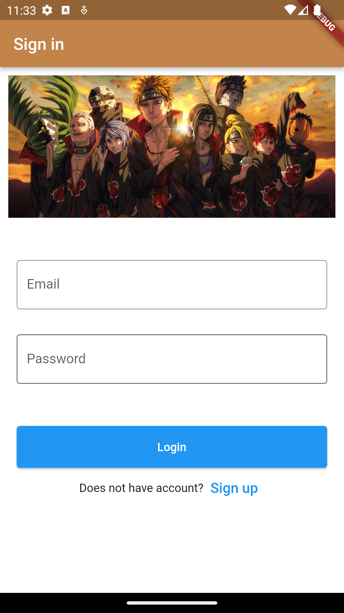

# Auth App

A new Flutter project with cloud db.

# My Project

Here's a sample README file for an auth app:

Auth App
The Auth App is a simple authentication and authorization app that allows users to sign up and log in to access protected resources.

Features
User registration with email and password
User login with email and password
Password reset functionality
Secure token-based authentication and authorization
Protected resources that require user authentication and authorization
Technologies Used
Flutter for the frontend UI
Dart programming language for the backend logic
Firebase Authentication for user authentication and authorization
Firestore for storing user data and app resources
Installation
Clone the repository or download the ZIP file.
Open the project in your preferred code editor, such as VS Code or Android Studio.
Install the required dependencies by running flutter pub get in the project root directory.
Configure the Firebase project in the Firebase Console, and download the google-services.json file.
Replace the google-services.json file in the android/app directory with the downloaded file.
Run the app on your emulator or physical device by running flutter run.
Usage
To use the app, follow these steps:

Open the app on your device or emulator.
Create a new account by tapping the "Sign Up" button and providing your email and password.
Log in to your account by providing your email and password on the login screen.
Access the protected resources in the app, such as settings or preferences.

## Screenshot

Here's a screenshot of the project:

## Getting Started

This project is a starting point for a Flutter application.

A few resources to get you started if this is your first Flutter project:

- [Lab: Write your first Flutter app](https://docs.flutter.dev/get-started/codelab)
- [Cookbook: Useful Flutter samples](https://docs.flutter.dev/cookbook)

For help getting started with Flutter development, view the
[online documentation](https://docs.flutter.dev/), which offers tutorials,
samples, guidance on mobile development, and a full API reference.
